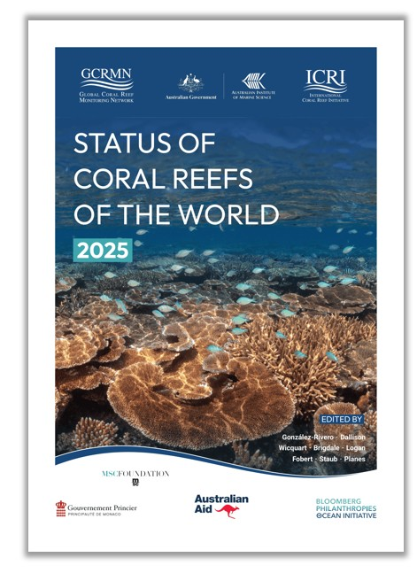

<!-- README.md is generated from README.Rmd. Please edit that file -->

```{r, include = FALSE}
knitr::opts_chunk$set(
  collapse = TRUE,
  comment = "",
  out.width = "100%"
)
options(tibble.print_min = 5, tibble.print_max = 5)
```

# **Status of Coral Reefs of the World: 2025**

## 1. Introduction [](https://doi.org/10.59387/LFPR6347)

Coral reefs are increasingly threatened by anthropogenic activities, from climate change-induced disturbances such as marine heatwaves to local stressors including overfishing, pollution, and coastal development. The cumulative impacts of these stressors have profoundly altered the structure, function, and composition of coral reef ecosystems worldwide. One of the most widely documented consequences is the decline in hard coral cover, largely driven by the global coral bleaching events recorded in 1998, 2010, 2016, and 2024. Beyond their ecological consequences, the degradation of coral reefs undermines the capacity of these ecosystems to provide essential services to human populations, including coastal protection, food security through fisheries, and income from tourism.

Established in 1995 as an operational network of the International Coral Reef Initiative ([ICRI](https://icriforum.org/)), the Global Coral Reef Monitoring Network ([GCRMN](https://gcrmn.net/)) plays a central role in coordinating and strengthening coral reef monitoring worldwide. Working through ten regional nodes, the GCRMN produces regular assessments of the status and trends of coral reefs based on harmonised scientific data collected by monitoring programmes around the world. Its mission is to improve understanding of coral reef condition and change, support evidence-based policy and management, and strengthen the technical and human capacity for reef monitoring at local, national, regional, and global scales. GCRMN global and regional reports are designed to provide policymakers, managers, researchers, and international organisations with robust scientific evidence to inform coral reef conservation and management and to support countries in meeting national and international biodiversity commitments. Since its establishment, the GCRMN has published seven global reports, complemented by numerous regional and thematic assessments documenting the status and trends of coral reefs across its ten regions.

## 2. About this repository

This GitHub repository accompanies the GCRMN report [***Status of Coral Reefs of the World: 2025***](https://doi.org/10.59387/LFPR6347), which provides a comprehensive assessment of the status and trends of shallow-water coral reefs worldwide from 1980 to 2024. The report examines changes in key benthic components - hard coral, macroalgae, and turf algae - and assesses how major pressures affecting coral reef ecosystems have evolved over the past four decades. The report is organised into two main parts. **Part 1** provides a global assessment of coral reef status and trends, while **Part 2** presents assessments for each of the ten GCRMN regions. The report also includes **nine case studies**, which complement the main findings by exploring specific aspects of coral reef ecology, monitoring, and management, and **four boxes**, which provide additional context for interpreting the results and highlight some of the challenges associated with producing large-scale ecological syntheses.

This repository contains the code used to process and analyse the data and produce the results presented in the [***Status of Coral Reefs of the World: 2025***]( https://doi.org/10.59387/LFPR6347). It is intended to support transparency, reproducibility, and reuse of the analytical approaches developed for the global assessment. This repository is complemented by another GitHub repository, the [gcrmn_model_alt](https://github.com/GCRMN/gcrmn_model_alt) repository, which contains scripts for comparing different approaches to modeling benthic cover.

The report's Online Supplementary Materials, including modelled temporal trends in benthic cover and associated outputs, are archived on [Zenodo](https://zenodo.org/records/21824430).

## 3. Code

### Cleaning and selection (`a_`)

* `a01_select_benthic-data.R` Extract benthic cover data from [gcrmndb_benthos](https://github.com/GCRMN/gcrmndb_benthos).
* `a02_clean_intersect-reefs.R` 
* `a03_benthic-data_sources.R` Extract lists of datasetID and contributors details.
* `a04_clean_buffer-reefs.js` Create coral reef buffer polygons at 5, 20, 50, and 100 km using [GEE](https://earthengine.google.com/).
* `a05_clean_cyclones.R` Clean cyclones data.
* `a06_download_crw-year.R` 

### Indicators' extraction (`b_`)

* `b01_extract_population.js` Extract population indicators using [GEE](https://earthengine.google.com/). 
* `b02_extract_crw.R` Extract SST indicators.
* `b03_extract_cyclones.R` Extract cyclones indicators.
* `b04_region-characteristics.R` Extract region characteristics.

### Models (benthic cover) (`c_`)

* `c01_explo_benthic-data.qmd` Exploratory analyses of benthic cover data.
* `c02_select_pred-sites.R`     
* `c03_extract_predictor_gee.js`
* `c04_extract_predictor_gravity.R`
* `c05_extract_predictor_enso.R`
* `c06_extract_predictor_cyclones.R`
* `c07_extract_predictor_crw.R`
* `c08_model_data-preparation.R`
* `c09_xgboost-model.R`
* 
* `c11_format-results.R`

### Figures and tables (`d_`)

* `d01_geography-maps.R`     
* `d02_spatio-temporal.R`
* `d03_cyclones.R`
* `d04_crw.R`
* `d05_population.R`
* `d06_reef-extent.R`
* `d07_benthic-cover_trends.R`
* `d08_case-studies.R`

### Functions

* `data_descriptors.R` Get number of sites, surveys, datasets, first and last year of monitoring.
* `extract_coeff.R` Extract slope from linear regression.
* `graphical_par.R` Graphical parameters, including colors and fonts.
* `map_region_geography.R` Map of region (geography).
* `map_region_monitoring.R` Map of region (monitoring).
* `map_sphere.R` Map of region (sphere).
* `plot_trends_model.R` Plot temporal trends from models.
* `plot_trends_raw.R` Plot temporal trends from raw data.
* `prepare_benthic_data.R` Prepare benthic cover data for models.
* `theme_graph.R` Main ggplot theme for the plots of the reports.
* `theme_map.R` Main ggplot theme for the maps of the reports.

## 4. Reproducibility parameters

```{r echo=FALSE, message=FALSE}

# 1. Print session info ----

devtools::session_info(c("sf", "tidyverse", "tidymodels", "readxl", "terra", "future",
                         "furrr", "RcppRoll", "lwgeom", "patchwork", "ggtext", "colorspace"))

```
